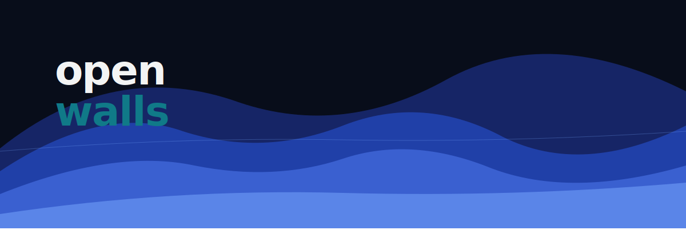

# Openwalls

Openwalls is a high-performance, modular wallpaper engine for Windows, designed for minimalist aesthetic and functional desktop enhancement.

## Core Features

- **Procedural Rendering Engine**: High-performance C# script-based wallpapers using Roslyn compilation for near-native execution speed.
- **Plug-and-Play Architecture**: Modular folder-based library system for easy sharing and management of wallpaper packs.
- **Zen Clock HUD**: High-fidelity, real-time system clock synchronization with customizable backdrops and cinematic typography.
- **Hardened Security Sandbox**: Pre-compilation static analysis and assembly whitelisting to protect users from malicious scripts.
- **Smart Resource Optimization**: Intelligent background task monitoring that auto-pauses playback when windows cover the desktop, minimizing CPU/GPU usage.
- **AI-Ready Bridge (MCP)**: Full Model Context Protocol server support allowing other AIs to natively browse, create, and manage wallpapers.

## Getting Started

1. **Launch**: Open the application to initialize the desktop layer.
2. **Dashboard**: Access the Openwalls Dashboard from the system tray to manage your library.
3. **Library**: Create new "Plug-and-Play" wallpapers by adding images, videos, or custom C# scripts to the library directory.
4. **Marketplace**: Browse the built-in marketplace tab to discover community-contributed procedural shaders and loops.

## Screenshots

## GIF

## Deployment and Contribution

For developers and creators looking to build custom procedural wallpapers:

- Refer to **MakeforOW.md** for the full API reference and security guidelines.
- Modular packs can be shared as simple directories containing a `wallpaper.json` and a `logic.cs` file.

## Platform Support

- Windows 11 (Optimized for Snap Layouts and Virtual Desktops)
- Windows 10

## Credits

Developed by Hello-Mirage.

## License

This project is licensed under the MIT License - see the LICENSE file for details.
